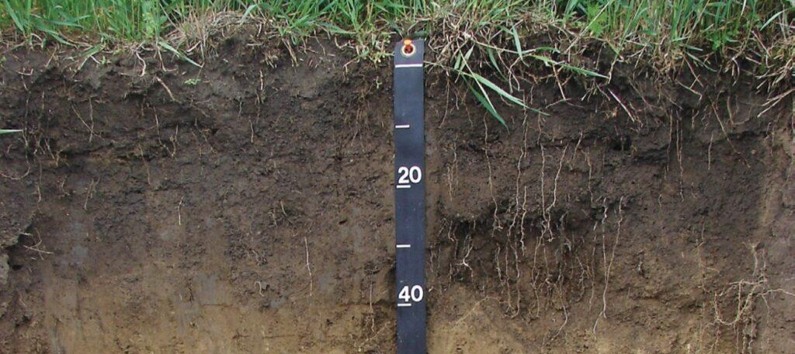

# Soil Module

 In agriculture simulations, such as those conducted using the EPIC model, soil data directly influences water availability, nutrient supply, and overall crop growth predictions. Soil input files to the model contain detailed information about the soil properties of a specific location, depth wise. GeoEPIC helps in generating soil files required by the EPIC Model from two soil data sources: <br>

- **[USDA SSURGO](https://www.nrcs.usda.gov/resources/data-and-reports/soil-survey-geographic-database-ssurgo)**: which contains detailed surveys of U.S. soils. <br>
- **[ISRIC SoilGrids 250m](https://soilgrids.org/)**: which offers global coverage in a grid format.



## Usage
<br>
#### USDA SSURGO

The USDA Soil Survey Geographic **(SSURGO)** database is a comprehensive resource for soil data collected by the Natural Resources Conservation Service **(NRCS)** across the United States and the Territories. This database provides detailed information on soil properties and classifications. The data is collected through extensive field surveys and laboratory analysis. For more detailed information, visit the [USDA NRCS SSURGO](https://www.nrcs.usda.gov/resources/data-and-reports/soil-survey-geographic-database-ssurgo) page.

To fetch and output soil files using the USDA SSURGO database, following commands could be used. For a specific location, specify the latitude and longitude coordinates to generate a soil file named {mukey}.SOL. 

```bash
# Fetch and output soil files for a specific latitude and longitude
>> GeoEPIC soil usda --fetch {lat} {lon} --out {out_path}

# Fetch for a list of locations in a csv file with lat, lon
>> GeoEPIC soil usda --fetch {list.csv} --out {out_dir}

# Fetch for crop sequence boundaries shape file.
>> GeoEPIC soil usda --fetch {aoi_csb.shp} --out {out_dir}
```

**Note:** This command will write Soil IDs (mukeys) corresponding to each location as an attribute into the input file, when used with a CSV file or crop sequence boundary shapefile.

**Processing ssurgo gdb file**:

To process a SSURGO GDB file and generate soil files for all unique soils contained in it, follow these steps. For instance, if you require soil files for Maryland, navigate to the 'State Database - Soils' section, and download the 'gSSURGO_MD.zip' file. Once the download is complete, extract the contents and place the GDB file in the 'soil' folder within your workspace. Use the following command to generate the soil files for all mukeys. 

Link: [https://www.nrcs.usda.gov/resources/data-and-reports/gridded-soil-survey-geographic-gssurgo-database](https://www.nrcs.usda.gov/resources/data-and-reports/gridded-soil-survey-geographic-gssurgo-database)

```bash
>> GeoEPIC soil process_gdb -i {path/to/ssurgo.gdb} -o {out_dir} 
```

#### ISRIC Soil Grids Data

The ISRIC Soil Grids 250 meters database is an advanced resource providing high-resolution global soil information. Managed by the International Soil Reference and Information Centre **(ISRIC)**, it uses state-of-the-art machine learning methods to map soil properties across the globe. The prediction models are based on soil profile observations and environmental covariates, including climate, land cover, and terrain morphology. SoilGrids offers soil properties at six standard depth intervals at 250 meters spatial resolution. For more detailed information, visit the [ISRIC Soil Grids](https://www.isric.org/explore/soilgrids) page.


To fetch and output soil files using the ISRIC Soil Grids 250 meters database, you can use the following commands.
```bash
# Fetch and output soil files for a specific latitude and longitude
>> GeoEPIC soil soilgrids --fetch {lat} {lon} --out {out_path}

# Fetch for a list of locations in a csv file with lat, lon, out_path columns
>> GeoEPIC soil soilgrids --fetch {list.csv} --out {column_name}
```

Once the tool finishes running, you should see files named {out_name}.SOL in your specified output directory. Open this file to verify that it contains the necessary soil data formatted correctly for use in the EPIC model.
<br>
<br>
<br>
**Refer to the EPIC manual for Soil file formatting**

<object data="../assets/soil.pdf" type="application/pdf" width="101%" height="700px">
  <p>Alternative text for the PDF</p>
</object>
