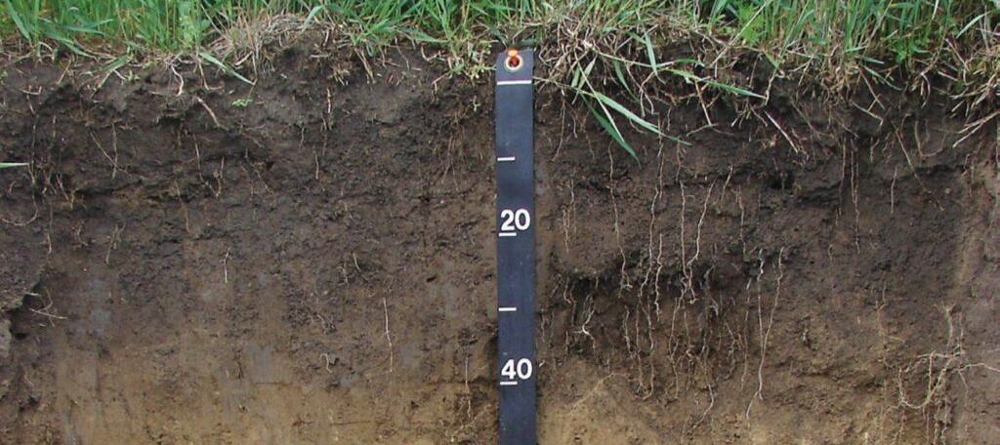
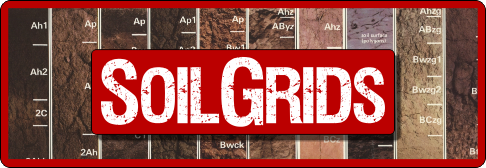

# Soil Module

Soil inputs strongly influence simulated water availability, nutrient supply, and crop growth. GeoEPIC can create EPIC `.SOL` files from USDA SSURGO data through the command line. SoilGrids support is available through the Python spatial API, but the current shipped CLI does not expose a `soil soilgrids` command.

- **[USDA SSURGO](https://www.nrcs.usda.gov/resources/data-and-reports/soil-survey-geographic-database-ssurgo)**: detailed U.S. soil surveys.
- **[ISRIC SoilGrids 250m](https://soilgrids.org/)**: global gridded soil properties available through `geoEpic.spatial.SoilGrids`.



## USDA SSURGO CLI

The USDA Soil Survey Geographic **(SSURGO)** database is a comprehensive resource for soil data collected by the Natural Resources Conservation Service **(NRCS)** across the United States and the Territories. This database provides detailed information on soil properties and classifications. The data is collected through extensive field surveys and laboratory analysis. For more detailed information, visit the [USDA NRCS SSURGO](https://www.nrcs.usda.gov/resources/data-and-reports/soil-survey-geographic-database-ssurgo) page.

For a specific location, provide latitude and longitude coordinates to generate a soil file named `{mukey}.SOL`.

```bash
# Fetch and output soil files for a specific latitude and longitude
geo_epic soil usda --fetch 39.0 -77.0 --out ./soil/files

# Fetch for a CSV file with latitude and longitude columns
geo_epic soil usda --fetch ./locations.csv --out ./soil/files

# Fetch for shapefile centroids
geo_epic soil usda --fetch ./fields.shp --out ./soil/files
```

Use `--raw` to save the fetched SSURGO table as CSV instead of writing `.SOL`.

## Processing a gSSURGO geodatabase

To process a local gSSURGO geodatabase, download the state geodatabase, extract it, and point your workspace `config.yml` at the `.gdb` path.

Link: [https://www.nrcs.usda.gov/resources/data-and-reports/gridded-soil-survey-geographic-gssurgo-database](https://www.nrcs.usda.gov/resources/data-and-reports/gridded-soil-survey-geographic-gssurgo-database)

```bash
geo_epic soil process_gdb -c config.yml
```

The command reads `soil.ssurgo_gdb`, `soil.files_dir`, `soil.soil_map`, `site.slope_length`, and region settings from `config.yml`.

## SoilGrids Python access



The current command-line dispatcher does not register a SoilGrids soil command. For Python workflows, use the spatial API:

```python
from geoEpic.spatial import SoilGrids

soil = SoilGrids.fetch(lat=39.0, lon=-77.0)
```

Once a `.SOL` file is generated, open it to verify that it contains the expected layers and formatting before running EPIC.
<br>
<br>
<br>
**Refer to the EPIC manual for Soil file formatting**

<object data="../assets/soil.pdf" type="application/pdf" width="101%" height="700px">
  <p>Alternative text for the PDF</p>
</object>
