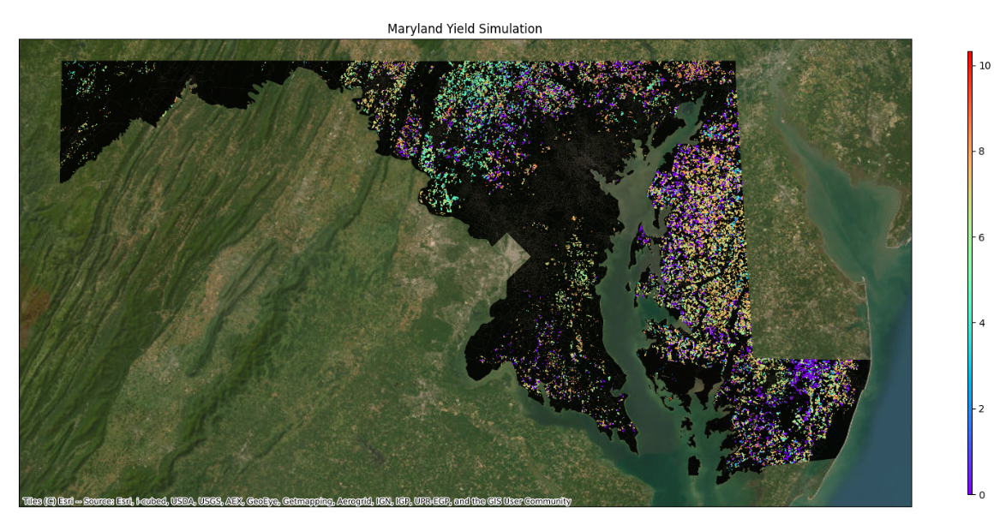

# Geo-Epic

##### A toolkit for geospatial crop simulations using EPIC model

 
<!--  -->

## Overview

This package expands the capabilities of the **EPIC crop simulation model**, to simulate crop growth and development across large geographies, such as entire states or counties by leveraging openly availabe remote sensing products and geospatial databases. Additionally, the toolkit features a unique calibration module that allows fine-tuning of model parameters to reflect specific local conditions or experimental results. This toolkit allows researchers to assess crop production potential, management scenarios and risks at broader scales, informing decision-making for sustainable agricultural practices.

## Installation

Setup a Virtual environment. (conda Recommended)
```bash
>> conda create --name epic_env python=3.9
>> conda activate epic_env
```
Install the EPIC Python Package
```bash
>> pip install git+https://github.com/smarsGroup/EPIC-pkg.git
```

Before starting the setup, ensure you have [`wget`](https://cloudcone.com/docs/article/the-linux-wget-command/) and [`conda`](https://docs.conda.io/projects/conda/en/latest/user-guide/install/linux.html) installed. <br> Follow the links for corresponding installation guides.