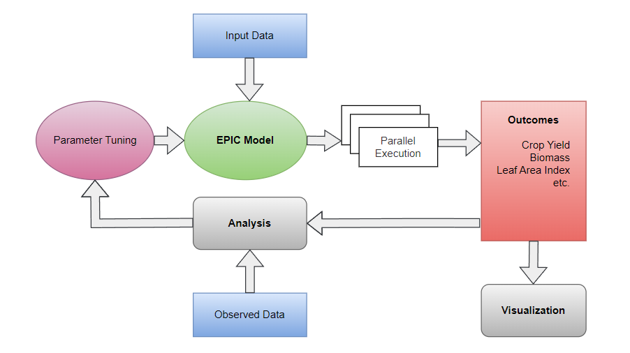

## Overview
The Calibration Module in Geo-Epic is developed to assist in tuning desired parameters involved in the EPIC model based on observational data, such as Leaf Area Index (LAI), Net Ecosystem Exchange (NEE), crop yield, or biomass. This allows model parameters to be refined to better reflect specific local conditions or experimental results.

## Getting Started

To begin calibration, import the calibration module from the package:

#### <ToDo\>

<!--  -->