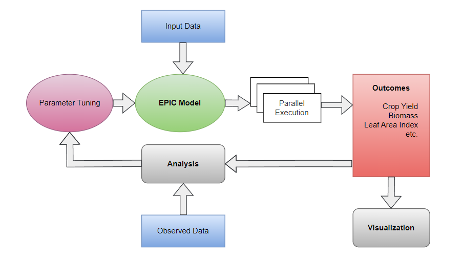

## Overview
The Calibration Module in GeoEPIC is developed to assist in tuning desired parameters involved in the EPIC model based on observational data, such as Leaf Area Index (LAI), Net Ecosystem Exchange (NEE), crop yield, or biomass. This allows model parameters to be refined to better reflect specific local conditions or experimental results.

## Getting Started

Calibration is built around three pieces:

- A `Workspace` that knows how to run EPIC.
- One or more editable parameter tables such as `CropCom` or `ieParm`.
- A `PygmoProblem` that applies candidate parameter values, runs the workspace, and returns the objective value.

The workspace `output_types` must include `DGN` when calibrating against daily LAI.

```yaml
output_types:
  - DGN
```

## LAI objective from DGN output

The example below compares simulated LAI from each site's `.DGN` file with an observed LAI CSV. The observed CSV is expected to contain `SiteID`, `Date`, and `LAI` columns.

```python
import numpy as np
import pandas as pd
import pygmo as pg

from geoEpic.core import Workspace, PygmoProblem
from geoEpic.io import DGN, CropCom, ieParm

workspace = Workspace("./config.yml")
observed = pd.read_csv("./observed_lai.csv", parse_dates=["Date"])
observed["SiteID"] = observed["SiteID"].astype(str)


@workspace.logger
def lai_error(site):
    simulated = DGN(site.outputs["DGN"]).get_var("LAI")
    simulated["SiteID"] = str(site.site_id)

    site_obs = observed[observed["SiteID"] == str(site.site_id)]
    merged = site_obs.merge(
        simulated,
        on=["SiteID", "Date"],
        suffixes=("_obs", "_sim"),
    )

    if merged.empty:
        return {"lai_rmse": np.nan}

    rmse = np.sqrt(np.mean((merged["LAI_obs"] - merged["LAI_sim"]) ** 2))
    return {"lai_rmse": rmse}


@workspace.objective
def objective():
    errors = workspace.fetch_log("lai_error")
    return [errors["lai_rmse"].dropna().mean()]
```

## Defining selected parameters

Parameter selection CSV files should include at least `Parm`, `Min`, `Max`, and `Select` columns. Selected rows are passed to PyGMO in the same order returned by the parameter object.

```python
crop = CropCom("./model")
crop.set_sensitive("./calibration/cropcom_params.csv", crop_codes=[56])

parms = ieParm("./model")
parms.set_sensitive("./calibration/ieparm_params.csv")

problem = PygmoProblem(workspace, crop, parms)
print(problem.var_names)
print(problem.get_bounds())
```

## Running an optimizer

```python
prob = pg.problem(problem)
algo = pg.algorithm(pg.de(gen=20))
pop = pg.population(prob, size=20)
pop = algo.evolve(pop)

print(pop.champion_x)
print(pop.champion_f)
```

`PygmoProblem.fitness()` writes candidate values into the selected parameter objects, saves them into the model directory, runs the workspace, and returns the workspace objective. If every selected variable receives the same value during a run, inspect the parameter CSV selection, bounds, and the `problem.var_names` order before running a large optimization.


<!--  -->
