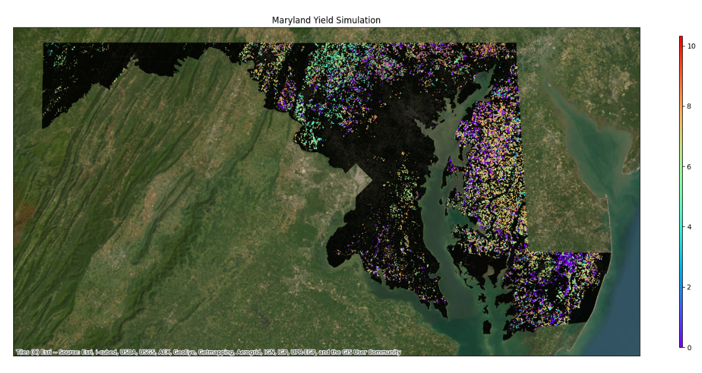

# Running an EPIC Experiment

### 1. Create new workspace

```bash
geo_epic workspace new -n Test
cd Test
```

This creates a workspace directory with the packaged template structure, including model, management, site, soil, weather, and configuration locations.

### 2. Edit config file as needed
GeoEPIC is mainly designed for study regions in the USA. In `config.yml`, update the experiment name, region code, input directories, and run information paths for your area of interest.

```yaml
EXPName: Nitrogen Assessment
Region: Maryland
code: MD
Fields_of_Interest: ./CropRotations/MDRotFilt.shp
run_info: ./info.csv

soil:
  ssurgo_gdb: ./soil/gSSURGO_MD.gdb
  soil_map: /path/to/SSURGO.tif
  files_dir: ./soil/files

site:
  dir: ./sites
  elevation: /path/to/SRTM_1km_US_project.tif
  slope: /path/to/slope_us.tif
  slope_length: ./soil/MD_slopelen.csv
```

Known limitation: the packaged template currently uses `Area_of_Interest`, while `workspace prepare` expects `Fields_of_Interest`. If you use `workspace prepare`, add or rename the key to `Fields_of_Interest` until the package code is updated.

### 3. Prepare OPC File
OPC files contain agricultural management operations. Place management files in the workspace OPC directory configured by `opc_dir`.

### 4. Prepare the workspace

```bash
geo_epic workspace prepare -c config.yml
```

This command prepares input files before simulation.

Validate the workspace before running a large batch:

```bash
geo_epic workspace validate -c config.yml
```

### 5. Execute simulations

```bash
geo_epic workspace run -c config.yml
```

The command runs EPIC for configured sites and writes enabled output files to `output_dir`.

## Example Visualization

### 6. Post-process the output visualization
Post-processing and visualization depend on functions referenced in `config.yml`.

#### For post-processing

```bash
geo_epic workspace post_process -c config.yml
```

#### For visualization

```bash
geo_epic workspace visualize -c config.yml
```

### Your plot will look like this:


